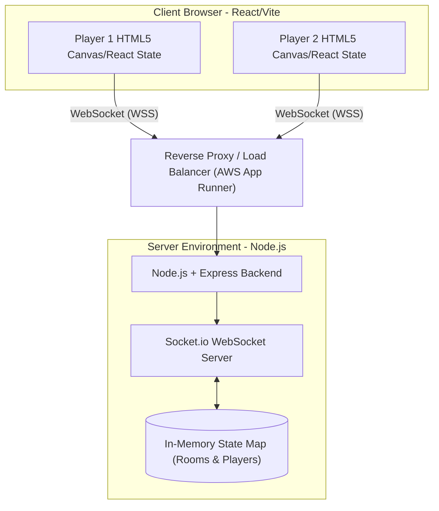

# BattleTris Architecture Overview

This document provides a high-level overview of the BattleTris application architecture, detailing the system design, core infrastructure, and specific design patterns used to implement the real-time multiplayer Tetris experience.

---

## 🏗 System Schematic

---

## 📦 Services & Infrastructure

The application operates as a full-stack monolithic TypeScript application that dynamically serves both the static frontend assets and the real-time websocket server from the same Node.js process.

### 1. Frontend Client
- **Framework:** React 19 coupled with Vite for fast HMR and optimized production builds.
- **Styling:** Tailwind CSS V4 for rapid UI development and `motion` for fluid interface animations.
- **Icons:** `lucide-react` for vectorized SVG icons.
- **State Management & Logic:** Complex game state is abstracted into custom hooks (e.g., `useTetris.ts`), which handle the matrix grid, SRS (Super Rotation System) rotation logic, line clears, and frame tick cycles internally, decoupled from the React render cycle where possible to ensure 60FPS.

### 2. Backend Server
- **Framework:** Node.js with Express.
- **Real-Time Communication:** `socket.io` handles full-duplex communication for matchmaking, multiplayer garbage/attack logic, and live board streaming.
- **Role:** Acts as the authoritative match coordinator. It dictates game start times, validates level-up conditions (in WW2 Mode), and handles room lifecycle management (creation, garbage collection).
- **Static Delivery:** In production (`NODE_ENV=production`), Express statically serves the compiled Vite `dist/` directory.

### 3. Deployment / Cloud
- **Primary Host:** AWS App Runner (PROD host defined in `config/prod-settings.yaml`).
- **Environment:** Node.js service running `npm start` with `NODE_ENV=production`.
- **Port:** Dynamically injected via `process.env.PORT` by the App Runner runtime.

---

## 🚀 Deployment Strategy

Release orchestration is managed via the global Antigravity **Git Orchestrator** and **Cloud Deploy** skills.

1. **Versioning:** Major, Minor, or Patch bumps are performed via `./scripts/bump-version.sh`.
2. **Multi-Platform Release:** An **Atomic Deployment** strategy is used to synchronize releases across multiple clouds.
3. **Trigger:** Deployments are triggered via specialized slash commands (`/deploy-full`, `/deploy-gcp`, etc.) which handle linting, building, tagging, and cloud rollout sequentially.
4. **App Runner Deploy:** Use `./scripts/deploy-apprunner.sh` to enforce `linux/amd64` builds and avoid arm64-only images.

---

## 🌐 Environments

> [!IMPORTANT]
> **Active Environment:** **PROD** (AWS App Runner)

| **Production** | AWS | `https://ts3i9njskc.us-east-2.awsapprunner.com` | Primary user-facing environment. |
| **QA / Staging** | AWS | `https://battletris-qa.us-east-1.awsapprunner.com` | Secondary target for verification. |
| **UAT** | AWS | `https://battletris-uat.us-east-1.awsapprunner.com` | User acceptance testing. |
| **Development** | Local | `http://localhost:8080` | Local iterations. |
| **Containers** | ECR | `battletris-v2` | Docker registry for AWS App Runner. |

---

## 🗄 Data Layer

**State Storage:** Fully **In-Memory**.
- There is currently no persistent database (like PostgreSQL or Redis).
- Match and lobby states are maintained as a TypeScript `Map<string, RoomState>` directly in the active Node process memory in `server.ts`.
- Memory is released via automated garbage collection timers (`ROOM_CLEANUP_DELAY_MS` = 60 seconds) when rooms empty out or matches conclude.

---

## 🧩 Architectural & Design Patterns

### 1. Event-Driven Messaging (Pub/Sub)
The multiplayer layer relies strictly on event-driven communication via Socket.io. Game interactions generate specific payloads (`send-garbage`, `update-board`, `lines-cleared`) which the server validates and publishes down to listeners in specific socket 'Rooms'. 

### 2. Throttled State Synchronization
To prevent network flooding and Node.js Event Loop blocking, the backend employs a **Throttling Pattern** for board updates. Clients emit `update-board` frequently, but the server batches or ignores intermediate frames, broadcasting `opponent-update` at a maximum of 10 ticks per second (`BOARD_UPDATE_THROTTLE_MS` = 100ms).

### 3. Controller / Hook Abstraction (Frontend)
The React frontend separates view logic from business logic using the **Custom Hook Pattern**. All core Tetris rules (piece collision, ghost piece mapping, rotation systems) live inside `useTetris.ts`, acting as the "Controller" and exposing a simplified interface and state getters to the "View" (`App.tsx`).

### 4. Guarded Exception Handling
The server employs an **Error Boundary Pattern** around real-time events. Every socket event is wrapped in a `safe<T>` try-catch generic wrapper. This prevents a malformed payload or singular bad function execution from throwing an unhandled exception and crashing the entire multiplayer Node.js process.
